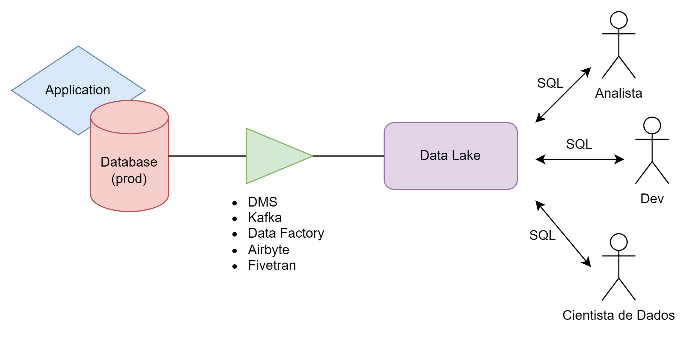

# Data Lake

## Overview

Everyday applications save their data in transactional databases, and analysts often need to access this data to support decision-making. However, querying analytical data directly from the production database is not a good practice, as read queries—especially those using operations like window functions, aggregations, and CTEs—can overload or even crash the database, causing significant disruptions to the application. Production databases should be accessed exclusively by services (not even developers should have read access to them).

So, how do we move this data to an analytical environment? That’s where the Data Lake comes in.

Our goal is to extract data from the database and transfer it to a Data Lake. To achieve this, we can use several tools, such as DMS (Data Migration Service - AWS), Kafka, Data Factory, Fivetran, among others.

