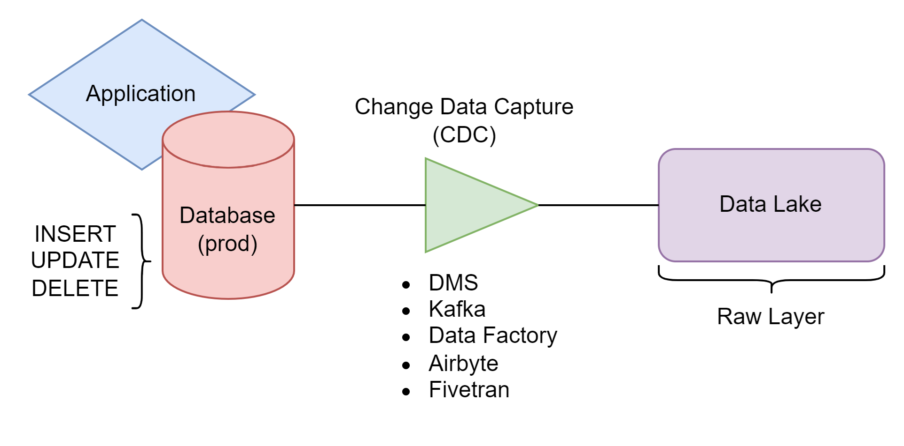

# Data Lake Creation Using Databricks

## Overview

Modern applications store their data in transactional databases, but analysts need access to this data to support decision-making. Querying analytical data directly from production databases is not recommended. Analytical queries—especially those involving operations like window functions, aggregations, and CTEs—can overload or even crash the production database, disrupting the application.

Since production databases should be reserved exclusively for services (developers should not have direct access), we need an alternative solution to access this data for analysis. This is where the **Data Lake** becomes essential.

---

## Step 1 – Gathering the Data

Our goal is to extract data from the production database and move it to a Data Lake. To achieve this, we can leverage tools such as:

- **AWS DMS (Data Migration Service)**
- **Kafka**
- **Azure Data Factory**
- **Fivetran**
- **Custom scripts (via JDBC connections)**

> **Note:** While using custom scripts is a quick solution, it isn’t always ideal. Scripts can put undue strain on the database, and unlike other tools mentioned above, they typically don’t support **change data capture (CDC)**, which tracks incremental changes efficiently.

Once extracted, the data lands in the **Raw Layer** of the Data Lake, the first stage in our architecture.

---

## Step 2 – Creating the Bronze, Silver and Gold Layers

Once the data is stored in the Data Lake (e.g., **S3**, **Blob Storage**, **GCS**), we structure it using the **Medallion Architecture**, which divides data into three layers: **Bronze, Silver, and Gold**. Each layer serves a distinct purpose:

- **Bronze Layer (Raw Data):**  
  Stores unprocessed data directly from sources like APIs and logs, preserving everything for auditing and reprocessing, even if it contains errors.

- **Silver Layer (Refined Data):**  
  Cleans and standardizes the data, eliminating errors and integrating information from multiple sources. At this stage, the data is suitable for operational and more reliable analyses.

- **Gold Layer (Ready-for-Consumption Data):**  
  Provides optimized, aggregated data for reports, dashboards, and strategic KPIs, ensuring consistency to support critical decision-making.

Below is a visual representation of the Medallion Architecture:

> **Note:** When using **CDC**, the **Raw Layer** differs from the **Bronze Layer**.  
> - **Raw Layer:** Logs all states of every record, capturing historical changes.  
> - **Bronze Layer:** Stores only the latest version of each record, mirroring the current state of the application database.

If CDC is not used, it’s common to skip the **Raw Layer**, starting directly with the **Bronze Layer** as the first destination for data after extraction from the production database.
